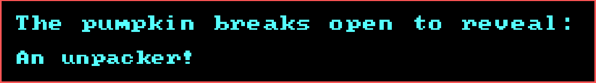
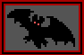

# Hugo Unpacker

<div align="center">

<h1></h1>


</div>

## 🎃 About The Project 🎃

A long time ago I fell in love with a little game called Hugo's House of Horrors. Even 30+ years on I still think about it often. Back in 2020 I downloaded it for a trip down memory lane, but started snooping around the install folder, wondering what the contents of each file were. Four years later, in an effort to write more low-level code and dip my toes in the freezing waters of reverse engineering, I finally put this project together.

The Hugo Unpacker "unpacks" the map data and graphical assets from Hugo's House of Horrors. (Okay, it doesn't handle the backgrounds and sprites yet, but hopefully soon.)

The map metadata assets were originally 320x200, but this program displays them in 640x400.

This currently supports `.b`, `.o`, and `.ob` files. These files represent 1-bit masks that determine the following:

```
.b - Walkable regions
.o - Foreground regions
.ob - Range to objects (maybe?)
```

I have tested this with Hugo 1 assets, but have not tested it with Hugo 2 or Hugo 3.

## 🦇 Getting Started 🦇

1. In `config\hugo.config` point `data_folder` to your Hugo installation (game not included)
2. Compile and run the project
3. Left and right arrow keys will cycle through the files

## 🌙 Prerequisites 🌙

This project was developed, compiled, and tested on:

* Windows 11
* Visual Studio 2022
* SDL 2.30.6

Drop the SDL dev and release libraries in the project's `lib` folder.

Here is the relevant snippet for Debug builds:

```
<ItemDefinitionGroup Condition="'$(Configuration)|$(Platform)'=='Debug|x64'">
    <ClCompile>
        ...
        <AdditionalIncludeDirectories>include;$(ProjectDir)lib\SDL2-2.30.6-dev\include;%(AdditionalIncludeDirectories)</AdditionalIncludeDirectories>
        ...
    </ClCompile>
    <Link>
        ...
        <AdditionalLibraryDirectories>$(ProjectDir)\lib\SDL2-2.30.6-dev\lib\x64;%(AdditionalLibraryDirectories)</AdditionalLibraryDirectories>
        <AdditionalDependencies>SDL2.lib;SDL2main.lib;%(AdditionalDependencies)</AdditionalDependencies>
        ...
    </Link>
    <PostBuildEvent>
        <Command>copy "$(ProjectDir)lib\SDL2-2.30.6-dev\lib\x64\SDL2.dll" "$(OutDir)"</Command>
    </PostBuildEvent>
</ItemDefinitionGroup>
```

And Release builds:

```
<ItemDefinitionGroup Condition="'$(Configuration)|$(Platform)'=='Release|x64'">
    <ClCompile>
        ...
        <AdditionalIncludeDirectories>include;$(ProjectDir)lib\SDL2-2.30.6-dev\include;%(AdditionalIncludeDirectories)</AdditionalIncludeDirectories>
        ...
    </ClCompile>
    <Link>
        ...
        <AdditionalLibraryDirectories>$(ProjectDir)lib\SDL2-2.30.6-dev\lib\x64;%(AdditionalLibraryDirectories)</AdditionalLibraryDirectories>
        <AdditionalDependencies>SDL2.lib;SDL2main.lib;%(AdditionalDependencies)</AdditionalDependencies>
        ...
    </Link>
    <PostBuildEvent>
        <Command>copy "$(ProjectDir)lib\SDL2-2.30.6" "$(OutDir)"</Command>
    </PostBuildEvent>
</ItemDefinitionGroup>
```

Check `hugo-unpacker.vcxproj` for full details.

## 💀 Roadmap 💀

Future versions (if they happen) might include:

- [ ] Enhanced viewer with a proper browser (no more modifying config files to change assets)
- [ ] Export functionality
- [ ] Support for background and sprite assets (.art and .pix files), including animations
- [ ] Proper cross-platform support

## 🏚️ Contributions 🏚️

Feel free to fork this project. As this is mostly an exercise in learning, I may never get around to accepting contributions, but don't let that stop you from trying. I appreciate the support.

## 👻 License 👻

This project is distributed under the MIT License. See [LICENSE](LICENSE.md) for details.

## ⚰️ Contact ⚰️

Gary B. Phillips - [@garythellama](https://twitter.com/garythellama)

Please feel free to reach out and say hello.

## 🧛 Acknowledgments 🧛

Tremendous and unending thank yous to the man, the myth, the legend himself: [David P. Gray](https://www.dgray.com/hwpage.htm).

Special thanks to [TheAlmightyGuru](https://moddingwiki.shikadi.net/wiki/User:TheAlmightyGuru) for his original reverse engineering work. Be sure to check out the incredible [DOS Game Modding Wiki](https://moddingwiki.shikadi.net/wiki/Main_Page).

<div align="center">



</div>
